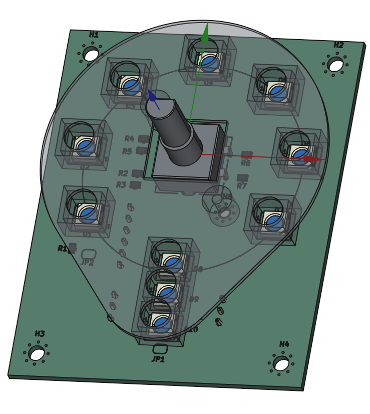

# DJ FLAB Board

The DJ FLAB is a multi-room audio control board from Fablab München.

Multiple of these boards are connected to an ESP32, each providing a simple control interface for a single room.
It has a rotary encoder for controlling the volume and switching the audio source, as well as ten WS2812B LEDs for indication.

